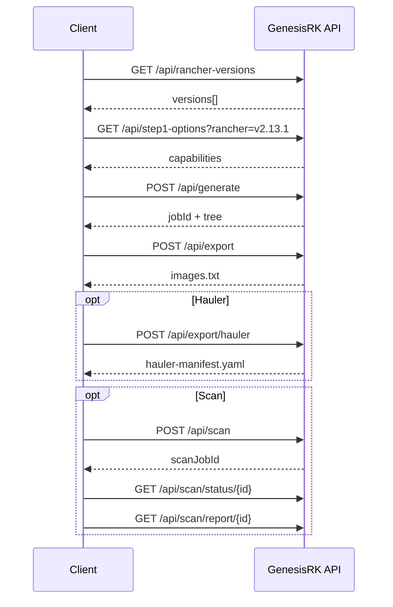

# REST API reference

Start the server:

```bash
genesisrk serve --port=8080 --static=frontend/dist
```

Base URL: `http://localhost:8080`

All API routes are under `/api/`. CORS is enabled (`Access-Control-Allow-Origin: *`).

Errors return JSON: `{"error": "message"}` with appropriate HTTP status.

---

## Overview

| Method | Path | Style | Description |
|--------|------|-------|-------------|
| GET | `/api/rancher-versions` | Read | List Rancher release versions |
| GET | `/api/step1-options` | Read | Distro/version capabilities for Step 1 |
| POST | `/api/generate` | Imperative JSON | Build image tree (returns job ID) |
| POST | `/api/export` | Imperative JSON | Export `images.txt` for a job |
| POST | `/api/export/hauler` | Imperative JSON | Export Hauler manifest for a job |
| POST | `/api/check-availability` | Imperative JSON | Check registry reachability |
| POST | `/api/scan` | Imperative JSON | Start async Trivy scan |
| GET | `/api/scan/status/{id}` | Read | Poll scan status |
| GET | `/api/scan/report/{id}` | Read | Download scan CSV |
| GET | `/api/release-notes` | Read | GitHub release notes + charts table |
| GET | `/api/logs` | Read | Recent server log lines |

The web UI uses these endpoints. Declarative YAML maps to `POST /api/generate` fields; see [config.md](config.md).

---

## GET `/api/rancher-versions`

List Rancher versions from GitHub releases.

### Query parameters

| Param | Type | Default | Description |
|-------|------|---------|-------------|
| `includeRC` | bool | `false` | Include alpha/beta/rc pre-releases |

### Response `200`

```json
{
  "versions": [
    { "version": "v2.13.1", "date": "2025-01-15" },
    { "version": "v2.12.4", "date": "2024-11-01" }
  ]
}
```

### Example

```bash
curl -s 'http://localhost:8080/api/rancher-versions?includeRC=true' | jq .
```

---

## GET `/api/step1-options`

Capabilities for Step 1: available K3s/RKE2/RKE versions from KDM (+ optional GitHub merge).

### Query parameters

| Param | Type | Required | Description |
|-------|------|----------|-------------|
| `rancher` | string | yes | Rancher version (e.g. `v2.13.1`) |
| `includeRC` | bool | no | Include pre-release k8s versions |
| `includeGitHubVersions` | bool | no | Merge versions from GitHub releases |

### Response `200`

```json
{
  "hasRKE1": true,
  "capabilities": {
    "k3s": {
      "versions": ["v1.32.11+k3s3", "v1.31.12+k3s1"],
      "sources": { "v1.32.11+k3s3": "kdm" }
    },
    "rke2": {
      "versions": ["v1.34.3+rke2r1"],
      "sources": { "v1.34.3+rke2r1": "both" }
    },
    "rke": {
      "versions": ["v1.28.15"],
      "sources": { "v1.28.15": "kdm" }
    }
  },
  "details": {
    "kdmUrl": "https://releases.rancher.com/kontainer-driver-metadata/release-v2.13/data.json",
    "imageListSource": "GitHub (k3s-io/k3s, rancher/rke2)"
  }
}
```

### Example

```bash
curl -s 'http://localhost:8080/api/step1-options?rancher=v2.13.1' | jq .
```

---

## POST `/api/generate`

Run the generator and return a selectable component tree. **Imperative JSON** — equivalent to CLI flags + config fields combined.

Jobs expire after 60 minutes.

### Request body

```json
{
  "rancherVersion": "v2.13.1",
  "rancherVersions": ["v2.13.1", "v2.12.4"],
  "isRPMGC": false,
  "includeAppCollectionCharts": false,
  "appCollectionAPIUser": "",
  "appCollectionAPIPassword": "",
  "distros": ["k3s", "rke2"],
  "cni": "cni_calico",
  "loadBalancer": true,
  "lbK3sKlipper": true,
  "lbK3sTraefik": true,
  "lbRKE2Nginx": true,
  "lbRKE2Traefik": true,
  "includeWindows": false,
  "k3sVersions": "v1.32.11+k3s3",
  "rke2Versions": "v1.34.3+rke2r1",
  "rkeVersions": ""
}
```

| Field | Type | Description |
|-------|------|-------------|
| `rancherVersion` | string | Single Rancher version (used when `rancherVersions` empty) |
| `rancherVersions` | string[] | Multiple versions — merges image lists |
| `isRPMGC` | bool | Rancher Prime GC source |
| `includeAppCollectionCharts` | bool | Fetch Application Collection |
| `appCollectionAPIUser` | string | App Collection API user |
| `appCollectionAPIPassword` | string | App Collection API token |
| `distros` | string[] | `k3s`, `rke2`, `rke` |
| `cni` | string | CNI preset ID |
| `loadBalancer` | bool | Master LB toggle |
| `lbK3sKlipper` | bool | K3s Klipper LB |
| `lbK3sTraefik` | bool | K3s Traefik |
| `lbRKE2Nginx` | bool | RKE2 NGINX Ingress |
| `lbRKE2Traefik` | bool | RKE2 Traefik |
| `includeWindows` | bool | Include Windows images |
| `k3sVersions` | string | Comma-separated or empty |
| `rke2Versions` | string | Comma-separated or empty |
| `rkeVersions` | string | Comma-separated or empty |

YAML config equivalent: see [config.md](config.md).

### Response `200`

```json
{
  "jobId": "550e8400-e29b-41d4-a716-446655440000",
  "roots": [
    {
      "id": "basic",
      "label": "Basic",
      "kind": "preset",
      "count": 42,
      "children": []
    }
  ],
  "basicCharts": [],
  "basicImageComponent": { "docker.io/rancher/rancher:v2.13.1": "rancher" },
  "pastSelection": ""
}
```

| Field | Description |
|-------|-------------|
| `jobId` | Pass to `/api/export` and `/api/export/hauler` |
| `roots` | Top-level tree nodes (Basic, AddOns, App Collection) |
| `basicCharts` | Chart subtree under Basic |
| `basicImageComponent` | Image ref → component label map |
| `pastSelection` | Serialized prior selection (if any) |

### Example

```bash
curl -s -X POST http://localhost:8080/api/generate \
  -H 'Content-Type: application/json' \
  -d '{
    "rancherVersion": "v2.13.1",
    "distros": ["rke2"],
    "cni": "cni_calico",
    "loadBalancer": true,
    "rke2Versions": "v1.34.3+rke2r1"
  }' | jq .
```

---

## POST `/api/export`

Export selected images as plain text (`images.txt`). Requires a valid `jobId` from `/api/generate`.

### Request body

```json
{
  "jobId": "550e8400-e29b-41d4-a716-446655440000",
  "selectedComponentIDs": ["basic", "cni_calico", "fleet", "rke2"],
  "chartNames": ["rancher-monitoring"],
  "selectedImageRefs": ["docker.io/rancher/rancher:v2.13.1"],
  "exportHauler": false
}
```

| Field | Type | Description |
|-------|------|-------------|
| `jobId` | string | From `POST /api/generate` |
| `selectedComponentIDs` | string[] | Component/group IDs from tree |
| `chartNames` | string[] | Selected chart names |
| `selectedImageRefs` | string[] | Exact image refs (overrides tree filtering) |
| `exportHauler` | bool | Ignored here — use `/api/export/hauler` |

### Response `200`

`Content-Type: text/plain`  
`Content-Disposition: attachment; filename=images.txt`

One image reference per line.

### Example

```bash
curl -s -X POST http://localhost:8080/api/export \
  -H 'Content-Type: application/json' \
  -d '{"jobId":"YOUR-JOB-ID","selectedComponentIDs":["basic"],"chartNames":[],"selectedImageRefs":[]}' \
  -o images.txt
```

---

## POST `/api/export/hauler`

Export a [Hauler](https://github.com/rancher/hauler) Images manifest YAML for the same selection.

### Request body

Same as `POST /api/export` (without `exportHauler` field).

### Response `200`

`Content-Type: application/x-yaml`  
`Content-Disposition: attachment; filename=hauler-manifest.yaml`

```yaml
apiVersion: content.hauler.cattle.io/v1
kind: Images
metadata:
  name: 2.13.1-rancher-images
spec:
  images:
    - name: docker.io/rancher/rancher:v2.13.1
    - name: docker.io/rancher/rancher-agent:v2.13.1
```

### Example

```bash
curl -s -X POST http://localhost:8080/api/export/hauler \
  -H 'Content-Type: application/json' \
  -d '{"jobId":"YOUR-JOB-ID","selectedComponentIDs":["basic"],"chartNames":[],"selectedImageRefs":[]}' \
  -o hauler-manifest.yaml
```

---

## POST `/api/check-availability`

Check whether images are reachable in their upstream registries (HEAD manifest).

### Request body

```json
{
  "images": [
    "docker.io/rancher/rancher:v2.13.1",
    "docker.io/rancher/rancher-agent:v2.13.1"
  ]
}
```

### Response `200`

```json
{
  "results": {
    "docker.io/rancher/rancher:v2.13.1": {
      "status": "available",
      "detail": "HTTP 200"
    },
    "docker.io/rancher/missing:tag": {
      "status": "missing",
      "detail": "HTTP 404"
    }
  }
}
```

Status values: `available`, `missing`, `auth_required`, `error`.

---

## POST `/api/scan`

Start an asynchronous Trivy vulnerability scan (max 50 images).

### Request body

```json
{
  "images": ["docker.io/rancher/rancher:v2.13.1"]
}
```

### Response `200`

```json
{
  "scanJobId": "660e8400-e29b-41d4-a716-446655440001"
}
```

Poll with `GET /api/scan/status/{id}`. Jobs expire after 30 minutes.

---

## GET `/api/scan/status/{id}`

### Response `200`

```json
{
  "status": "completed",
  "error": "",
  "summary": {
    "critical": 0,
    "high": 2,
    "medium": 5,
    "low": 10
  }
}
```

Status: `running`, `completed`, `failed`.

---

## GET `/api/scan/report/{id}`

Download CSV scan report when status is `completed`.

`Content-Type: text/csv`

---

## GET `/api/release-notes`

Fetch GitHub release notes and charts table for a Rancher component repo.

### Query parameters

| Param | Required | Description |
|-------|----------|-------------|
| `repo` | yes | GitHub repo (e.g. `rancher/rancher`) |
| `tag` | yes | Release tag (e.g. `v2.13.1`) |

### Response `200`

```json
{
  "tag": "v2.13.1",
  "name": "v2.13.1",
  "publishedAt": "2025-01-15T00:00:00Z",
  "url": "https://github.com/rancher/rancher/releases/tag/v2.13.1",
  "prerelease": false,
  "charts": [{ "name": "rancher", "version": "2.13.1" }],
  "changelog": ["Fix for ...", "Update ..."]
}
```

---

## GET `/api/logs`

Recent server log lines (for UI loading screen).

### Response `200`

```json
{
  "lines": [
    "time=\"...\" level=info msg=\"Loading KDM from ...\"",
    "time=\"...\" level=info msg=\"Fetched 1234 images\""
  ]
}
```

---

## Typical API workflow



---

## Mapping: YAML → API → CLI

| YAML field | API field | CLI flag |
|------------|-----------|----------|
| `distros` | `distros` | via `--config` |
| `cni` | `cni` | via `--config` |
| `loadBalancer` | `loadBalancer` | via `--config` |
| `versions.k3s` | `k3sVersions` | via `--config` |
| `groups` | (export selection) | `--config` + tree selection |
| `export.hauler` | `/api/export/hauler` | `--hauler` |
| `scan.enabled` | `/api/scan` | `--scan` |
| — | — | `-o`, `--kdm`, `--chart` (CLI only) |
