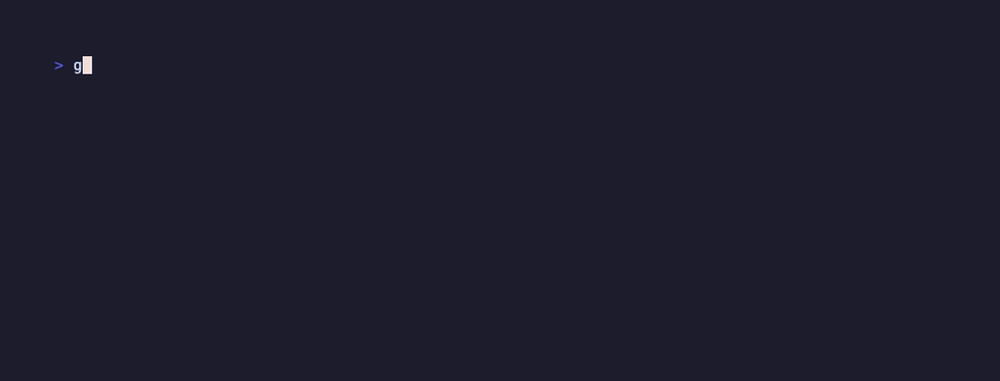

# GenesisRK documentation

GenesisRK generates Rancher image lists for air-gapped deployments. It sits on [Hangar](https://github.com/cnrancher/hangar) — use GenesisRK to **plan** what to mirror, then Hangar to **mirror/save/load** into your private registry.

## How to use GenesisRK

There are four equivalent ways to drive the same generator. Pick what fits your workflow:

| Mode | Style | Best for |
|------|--------|----------|
| [CLI — imperative](cli.md) | Flags on the command line | One-off runs, scripting, quick tests |
| [CLI — declarative](config.md) | YAML config file | CI/CD, GitOps, reproducible pipelines |
| [CLI — TUI](cli.md#tui-interactive) | Interactive terminal UI | Exploring options, learning the tree |
| [REST API](api.md) | HTTP JSON | Automation, integrations, custom UIs |
| [Web UI](web-ui.md) | Browser | Demos, workshops, non-CLI users |

All modes produce the same outputs: `images.txt`, `*-versions.txt`, optional Hauler manifest, optional scan report.

## Guides

- [Getting started](getting-started.md) — install, first run, terminal demos
- [CLI reference (imperative)](cli.md) — every flag and subcommand
- [Config reference (declarative YAML)](config.md) — full schema
- [REST API reference](api.md) — every endpoint, request/response types
- [Web UI](web-ui.md) — Step 1 → Generate → Select → Export
- [Outputs & exports](outputs.md) — images.txt, Hauler, scan, versions
- [Air-gapped workflow](airgap-testing.md) — GenesisRK + Hangar on AWS infra
- [Deployment](deploy.md) — Docker, Azure Container Apps
- [Image list decisions](IMAGE_LIST_DECISIONS.md) — how lists are built from KDM/charts

## Terminal demos

Recorded with [VHS](https://github.com/charmbracelet/vhs) — replay with `vhs docs/vhs/<name>.tape`.

See also: [generate](assets/generate.gif) · [tui](assets/tui.gif) · [serve](assets/serve.gif)

## In the web UI

Click **Docs** in the header (or open `#docs`) to browse these markdown files in the browser with a sidebar nav. The UI loads the same files from `/docs/*.md` at build time via `npm run sync-docs`.

## Live demo

https://genesis-app.bravecoast-8b272aef.westeurope.azurecontainerapps.io/
